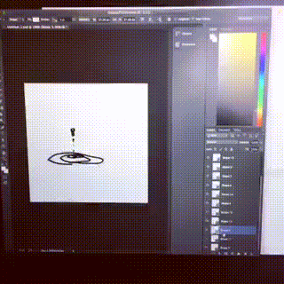
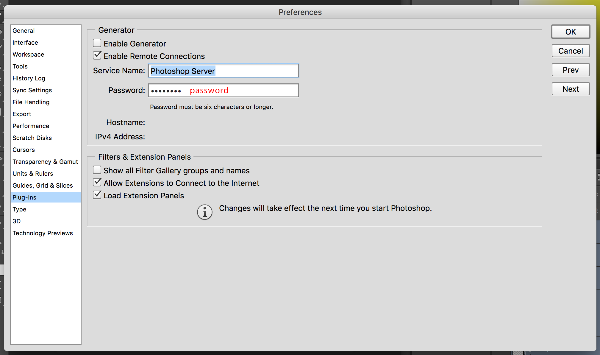

# PsGenILDA

Create ILDA based Laser Animations by Photoshop(>=2013) ( with openframeworks. )

## Setup

### 1. Setup adobe-photoshop/generator-core

https://github.com/adobe-photoshop/generator-core

    git clone git@github.com:adobe-photoshop/generator-core.git
    cd generator-core
    npm install

### 2. Setup Photoshop

1. Open Preferences > Plug-ins.

2. Uncheck `Enable Generator`.

3. Check `Enable Remote Connections`.

4. Set Password to `password`.

### 3. Placement this sources and install

||||
|:--|:--|:--|
|adobe-photoshop|generator-core|(git-repos)|
||plugins|PsGenILDA|

    cd path/to/PsGenILDA
    npm install

### 5. Run PsGenILDA

    cd path/to/generator-core
    node app -f ../plugins

### 6. Run openframeworks App.

**/PSGenILDA/openframeworks/app/PsGenILDADebug**

### 7. At Photoshop. Write shapes and select layers.

---

## oF App

### Dependencies

- ofxILDA
- ofxEatherDream
- ofxMSAInteractiveObject
- ofxOsc
- ofxSimpleGuiToo
- ofxXmlSettings
